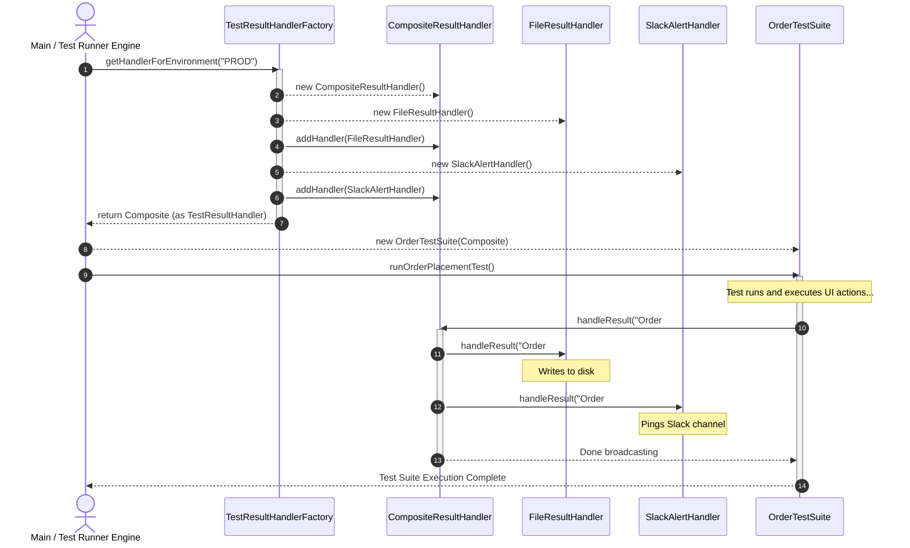

Here is the updated, completely unified interview kit in markdown.

The instantiation and execution code block (`Main.main`) has been completely restored in **Step 5**, and the **Mermaid diagram** now perfectly mirrors this exact initialization, factory lookup, object injection, and polymorphic execution flow.

# Java Developer & Senior SDET Interview Kit

This guide helps evaluate **Mid-Level Java Developers** and **Senior SDETs**. A Mid Dev must write adaptable code. A Senior SDET must design robust **test automation frameworks** where poor architecture causes flaky test suites. 

---

## 1. Practical Coding Scenario: The Notification Logger

Present this tightly-coupled code block via screen-share or an online editor.

### Problem Code
```java
public class OrderTestSuite {
    public void runOrderPlacementTest(String environment) {
        System.out.println("Step 1: UI Actions to place order...");

        // The Trap: Tight coupling and hardcoded conditional logic
        if (environment.equals("QA")) {
            System.out.println("[QA LOG]: Test passed. Writing result to local text file...");
        } else if (environment.equals("PROD")) {
            System.out.println("[PROD ALERT]: Sending critical slack alert to engineering channel...");
        } else if (environment.equals("PERFORMANCE")) {
            System.out.println("[PERF DATA]: Pushing execution time metric to Datadog database...");
        }
    }
}
```

### The Interview Prompt
> *"This test runner logs results differently depending on the environment using a mess of `if-else` blocks. Refactor this using solid OOP principles. A tester must be able to add a new 'UAT' environment that sends an email without modifying the `OrderTestSuite` class."*

### Candidate Evaluation Metrics
*   **🔴 Red Flag (The Memorizer)**: Cleans up string comparisons, extracts the `if-else` block into a helper method, or switches to a Java `switch` block. Might name-drop patterns without implementing polymorphism cleanly.
*   **🟢 Green Flag (Architectural Thinker)**: Identifies a violation of the **Open/Closed Principle (OCP)**. Instantly decouples logging execution from the core test logic.

---

## 2. The Ideal Polymorphic Solution

The ideal solution leverages the **Strategy**, **Composite**, and **Factory** design patterns with **Dependency Injection (DI)**.

### Step 1: Define the Strategy Interface
Establish a clear, single-responsibility behavior contract.

```java
public interface TestResultHandler {
    void handleResult(String message);
}
```

### Step 2: Implement Concrete Strategy Classes
Isolate each environment's unique logging rules to eliminate the conditional blocks.

```java
// QA Strategy
public class FileResultHandler implements TestResultHandler {
    @Override
    public void handleResult(String message) {
        System.out.println("[QA LOG]: Test passed. Writing result to local text file: " + message);
    }
}

// PROD Strategy
public class SlackAlertHandler implements TestResultHandler {
    @Override
    public void handleResult(String message) {
        System.out.println("[PROD ALERT]: Sending critical slack alert to engineering channel: " + message);
    }
}

// PERFORMANCE Strategy
public class DatadogMetricHandler implements TestResultHandler {
    @Override
    public void handleResult(String message) {
        System.out.println("[PERF DATA]: Pushing execution time metric to Datadog database: " + message);
    }
}
```

### Step 3: Implement the Composite Strategy
Support scenarios requiring **multiple simultaneous notifications** (e.g., logging to a file *and* alerting Slack in PROD) without breaking the existing structure.

```java
import java.util.ArrayList;
import java.util.List;

public class CompositeResultHandler implements TestResultHandler {
    private final List<TestResultHandler> handlers = new ArrayList<>();

    public void addHandler(TestResultHandler handler) {
        handlers.add(handler);
    }

    @Override
    public void handleResult(String message) {
        for (TestResultHandler handler : handlers) {
            handler.handleResult(message);
        }
    }
}
```

### Step 4: Refactor the Core Test Runner
The runner remains clean and generic. It relies entirely on constructor-based Dependency Injection.

```java
public class OrderTestSuite {
    private final TestResultHandler resultHandler;

    public OrderTestSuite(TestResultHandler resultHandler) {
        this.resultHandler = resultHandler;
    }

    public void runOrderPlacementTest() {
        System.out.println("Step 1: UI Actions to place order...");
        String statusMessage = "Order #12345 placed successfully.";

        // Polymorphic broadcast to one or many targets
        resultHandler.handleResult(statusMessage);
    }
}
```

### Step 5: Wire via Configuration Factory and Execute
Decouple object creation using an environment-driven factory, then instantiate and run the workflow within the framework's main entry point.

```java
class TestResultHandlerFactory {
    public static TestResultHandler getHandlerForEnvironment(String env) {
        CompositeResultHandler composite = new CompositeResultHandler();

        switch (env.toUpperCase()) {
            case "QA" -> composite.addHandler(new FileResultHandler());
            case "PERFORMANCE" -> composite.addHandler(new DatadogMetricHandler());
            case "PROD" -> {
                composite.addHandler(new FileResultHandler());
                composite.addHandler(new SlackAlertHandler());
            }
            default -> throw new IllegalArgumentException("Unsupported environment: " + env);
        }
        return composite;
    }
}

public class Main {
    public static void main(String[] args) {
        // 1. Simulating an environment configuration lookup
        String currentEnv = "PROD"; 

        // 2. Factory handles the complexity of building 1 or multiple handlers
        TestResultHandler dynamicHandler = TestResultHandlerFactory.getHandlerForEnvironment(currentEnv);

        // 3. Inject the handler package. The suite code stays 100% agnostic
        OrderTestSuite suite = new OrderTestSuite(dynamicHandler);

        // 4. Run the suite execution
        suite.runOrderPlacementTest();
    }
}
```

---

## 3. System Architecture & Call Flow

This sequence chart matches the final initialization pipeline and polymorphic runtime broadcast shown in the code above.



---

## 4. Technical Screening Questions

### For Mid-Level Java Developers

#### Q1: Why should we avoid deep inheritance hierarchies (e.g., Class A extends B extends C extends D) in production?
*   **The Intent**: Screens out textbook definitions; identifies understanding of structural depth.
*   **Target Answer**: It causes **tight coupling** and violates encapsulation. If a parent class modification fixes a bug, it can silently corrupt down-stream child class expectations (the **Fragile Base Class** issue). **Composition over inheritance** should be standard practice.

#### Q2: In Spring Boot, what happens if a default `@Service` singleton bean holds a mutable instance variable altered by incoming HTTP requests?
*   **The Intent**: Validates understanding of state management and multi-threaded concurrency.
*   **Target Answer**: It introduces **thread-safety vulnerabilities** and race conditions. Because independent request threads share a single object instance, a user's private application data will cross-contaminate concurrent sessions. Singletons must be **stateless**, or scoped using `@RequestScope`.

### For Senior SDETs

#### Q1: How do you design a Page Object Model (POM) architecture to prevent a single page class from evolving into a 5,000-line "God Class"?
*   **The Intent**: Tests framework layout capabilities beyond basic automation tutorials.
*   **Target Answer**: Apply the **Single Responsibility Principle** via **Component-Based Architecture**. Divide large view layouts into decoupled, isolated pieces (e.g., `HeaderComponent`, `FooterComponent`, `NavigationMenu`). The master page class merely aggregates these sub-components using **composition**.

#### Q2: If a `BaseTest` class configures a shared WebDriver, but test targets dynamically require databases, SSH tunnels, or API clients, how do you scale it without cluttering the base setup?
*   **The Intent**: Targets adherence to **Interface Segregation** and **Single Responsibility** inside automation systems.
````

- **Target Answer**: Avoid bloating the root class. Inject additional test tools using **test listeners**, custom test engine extensions (like **JUnit 5 Extensions**), or decoupled composition fixtures. Compose target test attributes dynamically to avoid forcing light tests to inherit heavy, unneeded background infrastructure connections.

```

If you need to customize this kit further for an upcoming interview loop, let me know if you would like me to add a **grading scorecard rubric** to go right along with it!
```
